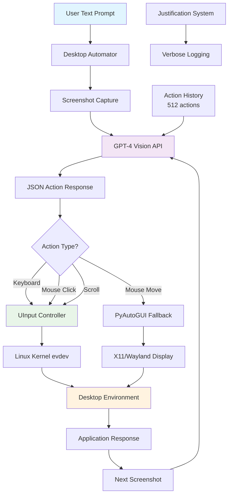

# AI Desktop Automation with LLM

## 🎬 Demo Videos & Screenshots

### User asks: "Write a table of 2 in libra office spreadsheet", AI performs:

📹 [Download Video](DEMO_VIDEOS_AND_SCREENSHOTS/Write%20a%20table%20of%202%20in%20libra%20office%20spreadsheet.mp4)

### User asks: "Write 5 killer jokes in libra office writer", AI performs:

📹 [Download Video](DEMO_VIDEOS_AND_SCREENSHOTS/Write%205%20killer%20jokes%20in%20libra%20office%20writer.mp4)

### User asks: "Find largest two zip files on my machine", AI performs:

📹 [Download Video](DEMO_VIDEOS_AND_SCREENSHOTS/Find%20largest%20two%20zip%20files%20on%20my%20machine.mp4)

### User asks: "Open clocks and start a new timer", AI performs:

📹 [Download Video](DEMO_VIDEOS_AND_SCREENSHOTS/Open%20clocks%20and%20start%20a%20new%20timer.mp4)

### User asks: "Open firefox and goto netflix website", AI performs:

📹 [Download Video](DEMO_VIDEOS_AND_SCREENSHOTS/Open%20firefox%20and%20goto%20netflix%20website.mp4)

### User asks: "Open this directory in files app", AI performs:

📹 [Download Video](DEMO_VIDEOS_AND_SCREENSHOTS/Open%20this%20directory%20in%20files%20app.mp4)

### User asks: "Start the stop watch", AI performs:

📹 [Download Video](DEMO_VIDEOS_AND_SCREENSHOTS/Start%20the%20stop%20watch.mp4)

---

An intelligent desktop automation system that uses Large Language Models (LLMs) to control Ubuntu desktop environments through visual understanding and direct input injection.

## 🏗️ System Architecture



### Key Components:
- **🧠 LLM Vision**: GPT-4 analyzes screenshots and generates actions
- **⌨️ UInput Controller**: Direct kernel-level input injection
- **🖱️ Hybrid Mouse**: UInput for clicks, PyAutoGUI for movement
- **📝 Action History**: 512-action context for intelligent decisions
- **🔍 Justification**: Every action includes reasoning
- **🛡️ Wayland Bypass**: Direct evdev injection circumvents compositor restrictions

## 🚀 Features

- **Visual Desktop Understanding**: Takes screenshots and uses GPT-5 to understand desktop state
- **Direct Input Control**: Uses Linux UInput for kernel-level keyboard/mouse control
- **Wayland Compatible**: Bypasses Wayland security restrictions that block traditional automation tools
- **Intelligent Actions**: LLM generates precise evdev actions with justifications
- **Hybrid Mouse Control**: UInput for clicks, pyautogui fallback for movement
- **Complete Character Support**: Full punctuation and special character typing
- **Verbose Logging**: Detailed execution logs for debugging and monitoring
- **Multiple Task Templates**: Pre-configured tasks for common automation scenarios

## 🛠️ Technical Architecture

### Core Components
- **Desktop Automator**: Main orchestration engine
- **UInput Controller**: Low-level input device management
- **LLM Integration**: OpenAI GPT-5 for visual reasoning and action planning
- **Action Execution**: Direct evdev code injection with fallback mechanisms

### Key Innovations
- **Wayland Super Key Fix**: Direct UInput injection bypasses compositor restrictions
- **Punctuation Key Support**: Added missing capabilities to UInput keyboard device
- **Action Justification**: Every action includes reasoning for transparency
- **Chronological History**: Maintains 512-action context for LLM decision making

## 📋 Requirements

### System Dependencies
```bash
sudo apt update
sudo apt install python3 python3-pip
sudo usermod -a -G input $USER  # Add user to input group
```

### Python Dependencies
```bash
pip3 install openai pyautogui evdev python-uinput pillow
```

### Permissions
- User must be in `input` group for UInput access
- `/dev/uinput` device access required

## 🚀 Quick Start

### Basic Usage
```bash
python3 desktop_automator_verbose.py
```

### Custom Task
Edit the `USER_PROMPT` variable in the script:
```python
USER_PROMPT = "open calculator and calculate 5 + 3"
```

### Available Task Templates
- Email automation with Outlook
- Excel spreadsheet creation
- Calculator operations
- Terminal commands and file operations
- Timer/clock management
- Web browser automation

## 🔧 Configuration

### OpenAI API Key
Set your OpenAI API key in the script:
```python
self.client = OpenAI(api_key='your-api-key-here')
```

### Verbosity Control
```python
automator = DesktopAutomatorVerbose(verbose=True)  # Enable detailed logging
```

### Action History
- Maintains up to 512 actions in chronological order
- Provides context for LLM decision making
- Includes timestamps and justifications

## 📊 Action Schema

The system uses direct Linux evdev codes in JSON format:

```json
{
  "action": "KEY_A" | "BTN_LEFT" | "REL_X" | "REL_Y",
  "state": "down" | "up" | "click",
  "value": 100,
  "justification": "Brief explanation of why this action is needed"
}
```

### Supported Actions
- **Keyboard**: All keys including punctuation (KEY_DOT, KEY_SLASH, etc.)
- **Mouse Buttons**: BTN_LEFT, BTN_RIGHT, BTN_MIDDLE
- **Mouse Movement**: REL_X, REL_Y with pixel precision
- **Mouse Scroll**: REL_WHEEL
- **Special Keys**: Super key (KEY_LEFTMETA), function keys, modifiers

## 🐛 Troubleshooting

### Common Issues
1. **Permission Denied**: Ensure user is in `input` group and reboot
2. **UInput Not Found**: Install `python-uinput` package
3. **Super Key Not Working**: System uses direct UInput injection (should work)
4. **Special Characters Missing**: Punctuation keys added to UInput capabilities

### Debug Mode
Enable verbose logging to see detailed execution:
```python
automator = DesktopAutomatorVerbose(verbose=True)
```

## 🔒 Security Considerations

- Requires elevated input permissions
- Direct kernel input injection capabilities
- Screen capture and AI analysis
- Use only in trusted environments

## 📝 Generated Files

The system creates several files during operation:
- `generated/screenshot_XXXX.png`: Desktop screenshots
- `generated/LLM_input_text_TIMESTAMP.txt`: Prompts sent to LLM
- `generated/LLM_output_text_TIMESTAMP.txt`: LLM responses
- Action history with timestamps and justifications

## 🤝 Contributing

1. Fork the repository
2. Create a feature branch
3. Make your changes
4. Test thoroughly on Ubuntu/Wayland
5. Submit a pull request

## 📄 License

MIT License - see [LICENSE](LICENSE) file for details.

## 👨‍💻 Author

**Aamer Khani**  
📧 aamerkhani@hotmail.com

## 🙏 Acknowledgments

- OpenAI for GPT-5 API
- Linux evdev and UInput subsystems
- PyAutoGUI for fallback mouse control
- Ubuntu/GNOME desktop environment
